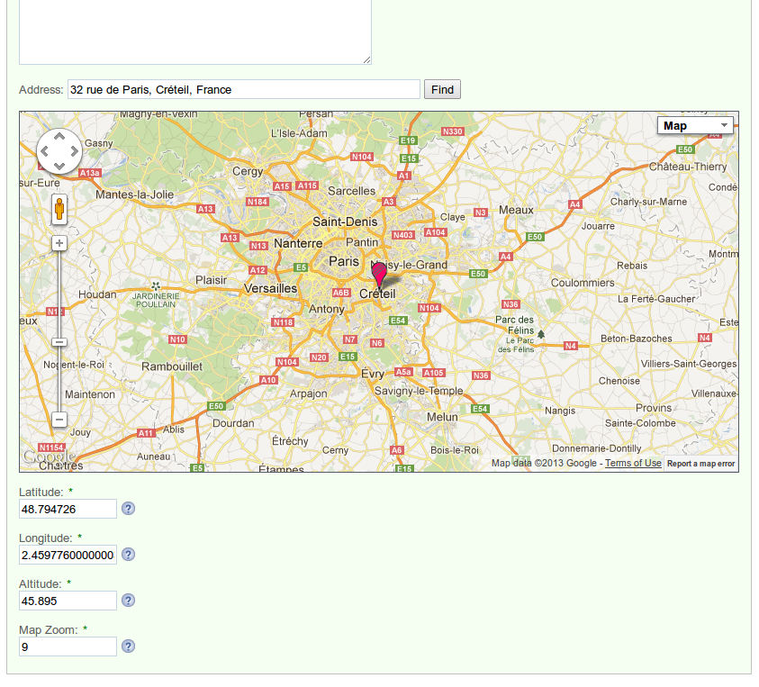
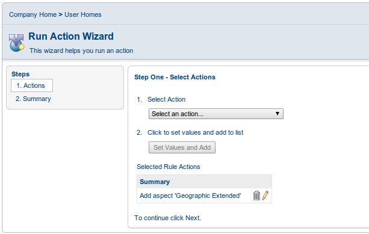
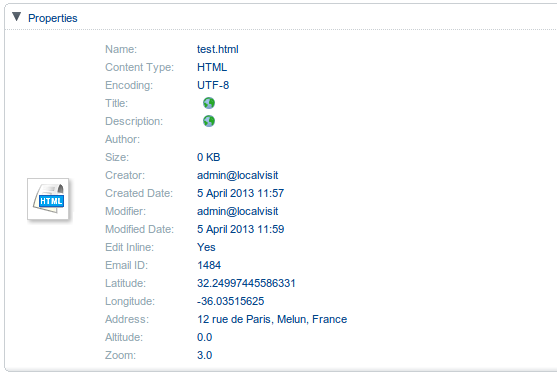

Geographic Extended aspect for Alfresco and form control for Alfresco Share
====================================

Author: Francois Liot francois@liot.org

Based on Google Maps API Elevation demo : [DaftLogic](http://www.daftlogic.com/sandbox-google-maps-find-altitude.htm) 

### Features

  * Extend Geographic aspect providing address, altitude and Share form.

Installation
------------

To install aspect :

  1. Copy alfresco-geo-ext-<version>.amp file into the `amps` directory
  2. Run `bin\apply_amps.sh` utility

To install the Share form control :

  1. Drop the `share-geo-ext-<version>.jar` file into the `tomcat/shared/lib` folder within your Alfresco installation

Configuration
------------

In your forms configuration file (share-config-custom.xml), under field-visibility, add

    <show id="ge:address" />
    <show id="cm:latitude" />
    <show id="cm:longitude" />
    <show id="ge:altitude" />
    <show id="ge:mapZoom" />

In your forms configuration file, under apperance, add

    <appearance>
       <field id="ge:address">
          <control template="/org/alfresco/components/form/controls/geo-ext.ftl"/>
       </field>
    </appearance>

And optionaly, you can hide technical geo fields, adding :

    <appearance>
       <field id="cm:latitude">
          <control template="/org/alfresco/components/form/controls/hidden.ftl"/>
       </field>
    </appearance>
    <appearance>
       <field id="cm:longitude">
          <control template="/org/alfresco/components/form/controls/hidden.ftl"/>
       </field>
    </appearance>
    <appearance>
       <field id="ge:altitude">
          <control template="/org/alfresco/components/form/controls/hidden.ftl"/>
       </field>
    </appearance>
    <appearance>
       <field id="ge:mapZoom">
          <control template="/org/alfresco/components/form/controls/hidden.ftl"/>
       </field>
    </appearance>

